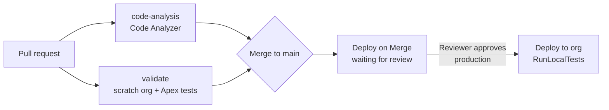

# Salesforce DevOps Pipeline

[](https://github.com/RobinSishodia/salesforce-devops-pipeline/actions/workflows/validate-pr.yml)
[](https://github.com/RobinSishodia/salesforce-devops-pipeline/actions/workflows/deploy-on-merge.yml)

An end-to-end CI/CD pipeline for Salesforce, built with Salesforce DX, the `sf` CLI and GitHub Actions. Every pull request is validated in a throwaway scratch org, and every merge to `main` is deployed to the target org with Apex tests enforced.

## How it works

```
 feature branch ──PR──▶ main ──merge──▶ target org
       │                  │
       ▼                  ▼
  Validate PR        Deploy on Merge
  • JWT auth to       • JWT auth to
    Dev Hub             target org
  • Create scratch    • Deploy metadata
    org               • RunLocalTests
  • Deploy metadata   • Gated by the
  • Run Apex tests      "production"
  • Delete scratch      environment
    org
```

| Workflow | Trigger | What it does |
| --- | --- | --- |
| [validate-pr.yml](.github/workflows/validate-pr.yml) | Pull request to `main` | Two parallel jobs. **code-analysis** scans the code with Salesforce Code Analyzer (PMD, ESLint, regex rules) and fails on High or Critical issues, uploading an HTML report. **validate** spins up a 1-day scratch org, deploys the source, runs all local Apex tests with coverage, then deletes the org. |
| [deploy-on-merge.yml](.github/workflows/deploy-on-merge.yml) | Push to `main`, or manual run | Waits for a reviewer to approve the `production` environment, then deploys the source to the target org with `RunLocalTests`. Deploys run one at a time and are never cancelled midway. |

### Approval before production

Deploys to production pause until a required reviewer approves them, and only `main` can deploy:



Example: [an approved production deployment](https://github.com/RobinSishodia/salesforce-devops-pipeline/actions/runs/37245217664), which waited for approval and then deployed in 33s with all tests passing.

## Tech stack

- **Salesforce DX** source format (API version 67.0)
- **Salesforce CLI (`sf`)** for org auth, scratch orgs, deploys and tests
- **GitHub Actions** for CI/CD
- **Salesforce Code Analyzer** for static analysis that blocks a PR on High or Critical issues
- **JWT bearer flow** for headless authentication through a connected app
- **Husky + lint-staged + Prettier** (with the Apex plugin) for pre-commit formatting

## Repository layout

```
.github/workflows/      CI/CD workflows
config/                 Scratch org definition
docs/                   Guides (Copado mapping)
force-app/main/default/
  classes/              ProjectService + test class
  objects/Project__c/   Custom object
```

## Setup

### 1. Connected app and certificate

1. Generate a private key and self-signed certificate (keep them out of Git; `certs/` is ignored):
   ```bash
   openssl req -x509 -sha256 -nodes -days 365 -newkey rsa:2048 \
     -keyout certs/server.key -out certs/server.crt
   ```
2. In your Dev Hub org, create a connected app with **Use digital signatures** enabled (upload `server.crt`), the `api`, `refresh_token` and `web` OAuth scopes, and **Admin approved users are pre-authorized** set for your user's profile.

### 2. GitHub secrets

| Secret | Value |
| --- | --- |
| `SF_CONSUMER_KEY` | Connected app consumer key |
| `SF_JWT_KEY` | Contents of `certs/server.key` |
| `SF_USERNAME` | Username of the Dev Hub / target org user |
| `SF_INSTANCE_URL` | `https://login.salesforce.com` (or your My Domain URL) |

### 3. Production environment (optional approval gate)

In **Settings → Environments**, open `production` (it is created on the first deploy run) and add required reviewers. After that, each merge waits for approval before it deploys.

## Local development

```bash
npm install
sf org login web --set-default-dev-hub --alias DevHub
sf org create scratch --definition-file config/project-scratch-def.json --alias dev --set-default
sf project deploy start
sf apex run test --code-coverage --result-format human --wait 10
```

## Copado

To see how this pipeline maps to Copado concepts (user stories, promotions, quality gates, back-promotion), read [docs/copado-guide.md](docs/copado-guide.md).
